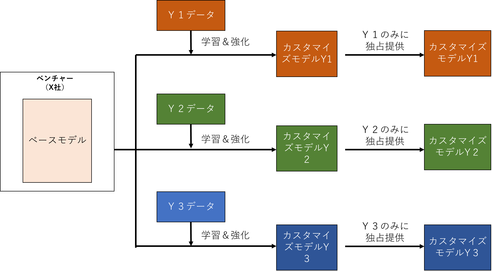
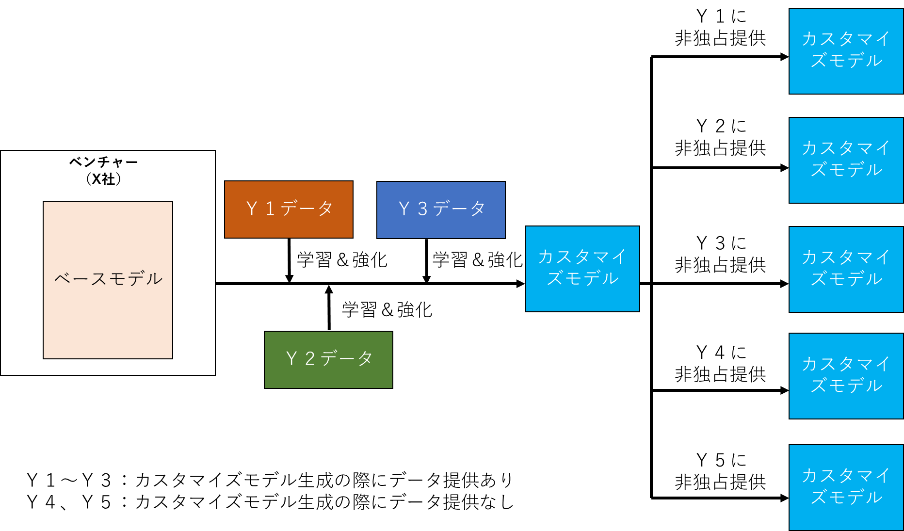

# モデル契約書ver1.0 利用契約書（AI）

## 想定シーン

1. X社（動画・静止画から人物の姿勢をマーカーレスで推定するAI技術を保有するスタートアップ）とY社（介護施設向けリハビリ機器の製造販売メーカー）の共同研究開発は順調に進んだ。そして開発成果として、介護施設内での被介護者の転倒・徘徊を、高い精度かつリアルタイムで検出できるカスタマイズモデルの生成および同カスタマイズモデルとY社が製造販売を検討している介護施設における被介護者の見守り用のカメラシステム（見守りカメラシステム）との連携システムの開発が完了した。
2. 開発成果に関する知的財産権の帰属については、カスタマイズモデルを含む成果物および開発過程において発生した著作権のうち連携システムおよびドキュメント類に関する著作権はY社に単独帰属、それ以外の著作権はX社に単独帰属する旨共同研究契約において合意している。
3. さらに、開発成果の提供方法については、連携システムについてはXからYに対してソースコードおよびドキュメント類の納品、カスタマイズモデルについては、成果物の確認に必要な期間（確認期間）中、カスタマイズモデルによる処理結果をAPIを通じて提供することで確認を行うこととなった。データや処理結果の具体的な流れは以下のとおりである。
    1. Yは、連携システムを組み込んだ見守りカメラシステムを開発し、通信機能付カメラと組み合わせて各介護事業者にSaaS方式で提供する。
    2. カメラは撮影およびデータ送信機能のみを有し、撮影された動画データは各介護事業者→ Y →Xの流れで送信される。
    3. 動画データについてカスタマイズモデルを用いたデータ解析および状態検出（推論）はXのサーバ上ですべて処理される。推論結果はXのAIシステムからAPI経由でYの見守りカメラシステムに送信され、事故が疑われる場合には見守りシステム上の介護施設側画面において警告表示がされる。

   

4. さらに、XとYにおいてカスタマイズモデルの利用条件や追加学習の内容について交渉を行った。交渉の経緯は以下のとおりである。
   Y：カスタマイズモデルの利用条件だが、Yが提供したデータおよびYが事業ドメインに関する各種ノウハウ等を提供した結果共同開発された学習済みモデルなので、Yのみに独占的に利用させて欲しい。また、今後当該サービスを利用する際にYからXに処理対象の動画データを大量に送信することになるが、当該データを利用してカスタマイズモデルの精度の維持・向上（追加学習）サービスも提供して欲しい。カスタマイズモデルをY社が独占的に利用することから、もちろん、追加学習にはY社が送信したデータのみを利用していただき、他社から提供されたデータは利用しないで欲しい。
   X：カスタマイズモデルの利用条件と、追加学習の内容についての要望と理解した。まず、カスタマイズモデルの共同開発にY提供データやノウハウが寄与していることは十分理解している。しかし、Yによる独占的利用ということになると、Xとしては当該カスタマイズモデルを利用した、それ以外のビジネスチャンスを犠牲にすることになる。また、Y社に対して独占的利用を行うということは、Xとしては、Y以外の、学習用のデータを提供したユーザに対しても、当該学習用データを利用して共同開発したカスタマイズモデルをそれぞれ独占的に提供するというビジネスモデルになる。その結果、個々のユーザごとのカスタマイズモデルが複数並立することになり、そのすべてのカスタマイズモデルをXが管理して各ユーザに提供することになる。
   たとえば、XがY1、Y2、Y3それぞれからデータを受領してカスタマイズモデルを共同開発し、それぞれのカスタマイズモデルについてY1～Y3との独占利用契約を締結した場合、以下のような提供形態となる。

   

   Y：それは理解できるが、何が問題なのか。
   X：このように、異なるカスタマイズモデルが並立すると、今後Xにおいて独自の研究開発に基づいてベースモデルのアップデートを継続的に行ったり、様々なユーザとのカスタマイズモデルを生成する過程において、Xは並立している全てのカスタマイズモデルについて同アップデートを前提としたメンテナンスを行う必要があり、必然的に管理コストが著しく上昇することになる。その結果、当該管理コストの負担を、Yをはじめとする事業会社に求めなければならない。具体的には、YとのSaaS契約において相当額の初期費用を負担いただくことが必須となり、かつAPIの利用料についても相応の金額にしていただく必要が生じることになる。
   Y：介護施設向け見守りシステムについては、実際にどの程度のニーズがあるのかは、今後実際に営業活動をしてみないとわからない部分があるため、現時点で初期費用を負担したり、利用料を高額に設定するとなると、Yにとってはかなりリスクが高いことになり応じ難い。
   X：その点は理解できる。なので、お互いにとってのリスクを低減するために、カスタマイズモデルについて非独占的な組み方が合理的だと考える。つまり、XはYに対してカスタマイズモデルをAPI経由で提供すると同時に、Y以外の第三者に対しても業界を超えてカスタマイズモデルを非独占的にAPI経由で提供するという組み方である。また、カスタマイズモデル生成の際のデータ提供はしないが、モデルを利用したサービスだけ利用したいという事業者も当然想定されることから、データを提供しない事業者に対してもサービス提供をすることになる。

   

   Y：ただ、そのような非独占的な組み方をすると、共同研究開発においてYがデータ提供やノウハウ提供で貢献したにもかかわらず、Yに何も見返りがないということにならないか。だとすると受け入れがたい。
   X：Yの貢献を利用条件に反映させる必要性はもちろん理解している。もし上記のような非独占的な組み方をした場合、弊社としてはモデルの管理コストが下がり、かつ様々な第三者（当該第三者がカスタマイズモデル生成の際にデータ提供をしたか否かに関わらない）に対して高精度なカスタマイズモデルを提供することができることになるので、事業規模・収益機会が拡大することになる。そこで、①　カスタマイズモデル生成の際にデータ・ノウハウを提供したYの寄与に見合った経済的便益（たとえば、一定期間、サービス利用料を介護領域における最安値からさらに一定の割合軽減する）を、一定期間Yに提供する、②　XのYに対するカスタマイズモデルの提供に際しても初期費用の負担は求めない、ということを考えている。このような組み方をすることで、介護施設向け見守りシステムの将来展開の不確実性に対応した、XY双方にとっての合理的なリスク・ベネフィット分配ができるのではないか。
   Y：なるほど。
   X：以上はカスタマイズモデル利用条件の問題だが、併せて追加学習サービスの範囲についても協議をさせて欲しい。Yの要請としては「今後当該サービスを利用する際にYからXに処理対象の動画データを大量に送信することになるが、当該データを利用してカスタマイズモデルの精度の維持・向上（追加学習）サービスも提供して欲しい」というものだが、その点についてはもちろんXとしても望むところであり有償にはなるが追加学習サービスを提供する。協議したいのは、当該追加学習サービスの内容である。Yとしては、どのような希望を持っているか。
   Y：Yとしては、Yが処理対象として送信したデータは、Yへの見守りサービスの提供およびYへの追加学習サービスのためのみに利用して欲しい。XがY以外の第三者に提供するモデルの追加学習のために利用するのは避けてほしい。また、カスタマイズモデルの追加学習は、Yが処理対象として送信したデータのみを用いて行い、第三者が提供したデータを用いた追加学習は行わないで欲しい。
   X：そのような、限定された追加学習サービスも技術的にはもちろん可能なのだが、先ほどカスタマイズモデルの利用条件として、非独占的な組み方の合理性について説明した。仮にそのような非独占的な組み方をする場合、追加学習についても、もう少し柔軟な内容、言い換えれば非限定的な内容にすることが合理的ではないかと考える。
   Y：具体的にはどういうことか。
   X：カスタマイズモデルの利用条件として非独占的な組み方をする合理性は、将来の見通しが不確実な状況の下、XY双方にとっての合理的なリスク・ベネフィット分配ができるという点にあった。また、そのような非独占的な組み方は、追加学習についても非限定的な内容を前提としている。具体的には、①Yが提供したデータを、Yに対するサービスにおいてだけでなくXにおいて広く追加学習に利用することができる、②Yが処理対象として提供したデータだけでなく、Y以外の第三者が提供したデータも用いて当初のカスタマイズモデルの追加学習を行うことができる、という内容である。このように、非限定的な追加学習を行うことによって、より幅広いデータを使って追加学習を行った高い精度・高い価値を有するモデルを利用することができることになる。
   Y：カスタマイズモデル利用条件について非独占的な組み方をするのであれば、追加学習サービスの範囲についても非限定的とするのが合理的という趣旨か。なるほど。ただ、その場合でもYが処理対象として提供したデータが第三者にわたるのは絶対に避けたい。
   X：もちろん、追加学習サービスにおいては、提供されたデータはX内でモデルの学習用のために使われるにすぎず、提供されたデータそのものが第三者にさらに提供されるわけではない。また、当然のことではあるが、契約上、Yから送信されたデータについてはXにおいて安全管理措置を施すことになる。
   Y：了解した。検討する。
5. 以上のような交渉を経て、①　カスタイマイズモデルの利用条件としては非独占的な内容としたうえで、②　カスタマイズモデルの共同開発におけるYの貢献を反映するために一定期間サービス利用料を介護領域における最安値からさらに10%（注：具体的条件設定についての基本的な考え方については後記解説を参照）軽減することとし、③　追加学習の内容については非限定的な内容とするということにX・Y間で合意をした。具体的には以下のとおりである。
    1. カスタマイズモデルの利用条件
        1. Xによる利用
            - 独占・非独占：非独占（Y以外の第三者に対してもカスタマイズモデルおよび同モデルを利用したサービスを提供可能）
            - 利用可能範囲：限定なし
        2. Yによる利用
            - 利用可能範囲：限定なし
            - サービス利用料：Yが連携システムを経由してAPIを利用した量に応じた従量課金。ただし、Yがカスタマイズモデルの共同開発に際してデータ・ノウハウ提供をした見返りとして、3年間、介護分野におけるサービス利用料の最安値からさらに10%引きとする。
            - 利用可能期間：●年間
    2. 追加学習サービスの内容
        - Xによるカスタマイズモデルへの追加学習の可否
          Yから送信されたデータおよび他ユーザから送信されたデータを用いた、特に制限のない追加学習が可能
        - Yが処理対象としてXに送信したデータの扱い
          本サービスの提供目的および追加学習のためにXにおいて制限なく利用可能
        - カスタマイズモデルに追加学習したモデルの権利帰属
          X
            - サービス利用料：月額●円
            - 期間：●年間

## 想定シーンの解説

1. 視点
   学習済みモデルの共同開発段階および利用・追加学習段階においては、
    1. 共同開発の成果物に関する知的財産権の帰属
    2. 成果物の利用条件
    3. 追加学習の内容
       が重要なポイントである。
       しかし、実際には、ともすれば①の知的財産権の帰属のみが交渉の対象となりがちであり、その結果、以下のように交渉が暗礁に乗り上げることがある。

   > 【事業会社】
   学習用データセットや学習済みモデルは、うちのノウハウや機密が詰まった生データを用いて生成されたものですし、開発に際して委託料も支払っています。うちに権利がありますよね？
   【スタートアップ】
   いやいや、生データだけでは学習済みモデルは生成できません。高性能なモデルができるのは、データの前処理やモデルの訓練過程いずれにおいてもうちの高度のノウハウと多大な労力あってこそです。うちに権利がありますよね？

   このような対立は、事業会社・スタートアップいずれもが「成果物等は自社のものである」、言い換えると「成果物の権利を自己に帰属させる」ことに双方が固執することに主として起因している。
   そして、このように「どちらが権利を持っているか」（権利の帰属）に双方がこだわっている限り双方の溝は埋まらず、交渉に多大な労力と時間がかかり結局双方が競争力を失うことになる。
   そこで、経済産業省が2018年に公開した「AI・データの利用に関する契約ガイドライン（AI編）」（以下「2018年ガイドライン」という。）の28頁以下において提案されているのが「権利帰属」と「利用条件」を分離して柔軟な条件設定をすることである。
   本モデル契約においても、①「権利帰属」と②「利用条件」を分離して柔軟な条件設定をすることを想定している。加えて、本モデル契約においては、さらに③の追加学習の内容を組み合わせることでより合理的な条件設定をした。
   以下説明をしていくが、まず①の権利帰属については、共同研究開発契約で定められているように、連携システムおよびドキュメント類に関する著作権はYに単独帰属し、それ以外の著作権はXに単独帰属することを前提とする。

2. 利用条件
   スタートアップにおいて「複数の事業会社からデータの提供を受けて生成したカスタマイズモデルを利用したサービスを、複数の事業会社に提供する」というビジネスモデルを採用する場合、カスタマイズモデルの利用条件は「交渉経緯」に記載したように非独占的な内容が合理的である。
    1. 内容
       XはYにカスタマイズモデルを、以下の条件で、範囲限定なくSaaS形式で非独占的に提供する。
        1. Xによる利用
            - 独占・非独占：非独占（Y以外の第三者に対してもカスタマイズモデルを提供可能）
            - 利用可能範囲：限定なし
        2. Yによる利用
            - 利用可能範囲：限定なし
            - サービス利用料：Yが連携システムを経由してAPIを利用した量に応じた従量課金
            - Yは、カスタマイズモデル生成に際してデータ・ノウハウを提供した見返りとして、一定期間、対象領域についてサービス利用料の最恵待遇条項やプロフィットシェアなどの経済的便益を受ける。
            - 利用可能期間：●年間
    2. 解説
        1. **<u>非独占的な提供の合理性</u>**
           カスタマイズモデルの利用条件としては、「交渉経緯」でY担当者が当初主張していたような「独占的な提供」という内容も一応考えうる。その場合、一定期間内は、XはY以外の第三者に対してカスタマイズモデルの提供が出来ないことになるが、そうすると、ごく例外的なケースを除いてスタートアップであるXのビジネスが成り立たなくなる。
           なぜなら、独占的な提供方法を採用した場合、XとしてはY以外の事業会社とも同様の条件で組むことになるが、そうすると個々の事業会社ごとのカスタマイズモデルが複数並立することになり、そのすべてのカスタマイズモデルをXが並列的に管理して各事業会社に提供することになる。
           そして、スタートアップにおいて独自の研究開発に基づいてベースモデルのアップデートを継続的に行っていく場合、スタートアップは並立している全てのカスタマイズモデルについても同アップデートを前提としたメンテナンスを行う必要があり、必然的に管理コストが著しく上昇することになる。そこで、スタートアップとしては利用料を高く設定しなければビジネスが成り立たないことになるが、事業開始時点の見通しが不透明な状況において事業会社が高い利用料設定に応じることは、ごく例外的な場合（たとえば、当該領域を当該事業会社が独占していて、高い収益が約束されている場合）以外は通常考え難い。その結果、スタートアップとしては、「将来にわたって低い利用料収入で高い管理コストを賄う」という状況に陥ることになり、事業の発展可能性を失う。
           そのため、ごく例外的な場合を除いてスタートアップにおいて「複数の事業会社からデータの提供を受けて生成したカスタマイズモデルを利用したサービスを各事業会社に提供する」というビジネスを提供する場合、カスタマイズモデルの利用条件は非独占的な内容、すなわちどの事業会社（この中には、カスタマイズモデル生成のためにデータ・ノウハウ提供をする会社も、しない会社も含まれる。）に対してもカスタマイズモデルないし同カスタマイズモデルを利用したサービスを提供できる、とするのが合理的である。
           そうすることで、スタートアップとしては、カスタマイズモデルを用いた事業展開に制約がなくなることから事業拡大・収益拡大の可能性が高まるとともに、管理コストも一定の範囲に抑えることができることから、将来的な発展可能性を確保することができる。
           また、社会的な見地から見ても、独占的な提供にとどめた場合「特定の企業のデータだけを用いた、十分な性能のない小さい学習済みモデルが複数存在する」という事態が生じることになるが、非独占的な提供および非限定的な追加学習を行うことで、より高精度な学習済みモデルを広い範囲のユーザに提供することができるというメリットが事業会社およびスタートアップの双方に発生することになる。
        2. **<u>Yの貢献をどのようにカスタマイズモデルの利用条件に反映させるか</u>**
           もっとも、カスタマイズモデルの利用条件を非独占的な内容にした場合、カスタマイズモデルの共同開発におけるYのデータやノウハウ面での寄与をどのようにして適切に反映させるかが問題となる。
           XがYに独占的にカスタマイズモデルを提供するというビジネス形態は、Yの寄与を反映させるための一つの方法ではあるが、そのようなビジネス形態が合理的ではないことは先ほど説明した。
           Yの寄与を反映させる方法として、XがYの当該寄与に見合った経済的便益をYに提供する方法がある。たとえば、最恵待遇条項（MFN条項：一定期間、サービス利用料を介護分野における最安値とする。）を設定する方法や、プロフィットシェア（カスタマイズモデルからXが得た売上の一部をプロフィットプールとし、同プロフィットプールを一定のルールに従って分配する方法）などである。
           しかし、プロフィットシェアはその設計が非常に複雑になり採用が容易ではない（後述のコラム参照）ため、本モデル契約においては最恵待遇条項（MFN条項）を採用することとした。
           さらに、単純な最恵待遇条項ではカスタマイズモデルの生成に対するYの貢献度を十分に反映できないことから、本モデル契約においてはYに対して、より大きなメリットを提供するために、「●年間、サービス利用料を、介護分野におけるサービス利用料の最安値の10%引きとする。」という条項（いわば「最恵待遇+ディスカウント条項」）を採用している。
           本モデル契約では「最恵待遇+ディスカウント条項」におけるディスカウント率を一応「10%」としているが、実際のディスカウント率を設定するに際しては、当該事業領域における利益率、当該事業会社による見込利用量、スタートアップにおけるコスト構造（特にAIスタートアップの場合は研究開発に要するコストが大きい。）を考慮したうえで決定する必要がある。
           また本条では、一定期間、一律「10%引き」という固定ディスカウント率としているが、「最恵待遇+ディスカウント条項」を設定する趣旨がYの貢献度を評価するものであることから、実際の貢献度に応じた条件設定をすることが望ましい。具体的には、Yの貢献としては、①　当初のモデルの共同開発への貢献や、②　追加データの提供による貢献が考えられるが、長期間にわたって多数の第三者が提供したデータによる追加学習が行われた場合、初期のユーザが提供したデータがカスタマイズモデルの精度向上に寄与する割合は逓減していくことを考えると、経過年数に応じてディスカウント率を下げていくことも考えられよう。
           このような最恵待遇条項（MFN条項）を設定する方法は、事業会社にとっては事業におけるコスト（サービス利用料）低減を意味する。本モデル契約の条項のように「対象領域における最安値からさらに10%引き」という設計とした場合、そのコスト低減効果はさらに大きくなり、事業会社の了承を得られる可能性が高くなる。
           MFN条項が持つコスト削減効果は、経済的にはプロフィットシェアと同じであるが、その一方で、MFN条項はプロフィットシェアよりもその設計・計算が容易であり、交渉コストが低いというメリットがある。
           なお、MFN条項を設ける場合には以下の点に留意する必要がある。
            1. **MFN条項の対象となる分野を特定する必要がある**
               たとえば、介護領域であれば、介護領域においてサービス利用をしている事業者の中での最安値（あるいは最安値からの定額割引）を保証するという形をとるという意味である。
               なぜなら、事業会社は対象分野ごとに競合他社と競争をしており、かつ事業分野によって事業の平均利益率は異なるため、APIを提供する際にも、その業界利益率を考慮した値決めが合理的だからである。
               本モデル契約においては、介護領域を対象とするMFN条項としている。
            2. **MFN条項の適用年限を限定する必要がある**
               AI領域は極めて技術の進歩スピードが速く、スタートアップが事業会社に当初提供したベースモデルの陳腐化のスピードも速いこと、スタートアップが非独占的にカスタマイズモデルを提供するビジネスモデルを採用する結果、同カスタマイズモデルのユーザは逓増し、事業会社が当初データおよびノウハウを提供した貢献度も逓減することから、MFN条項の適用年限を定めるべきである。具体的な適用年限は、秘密保持契約における秘密情報の陳腐化と同じ観点から、3年程度が合理的と思われる。
               本モデル契約においてはMFN条項の適用年限を3年間としている。
            3. **最低価格を参照する対象となる事業者（対象事業者）を適切に設定する必要がある**
               最後に、最低価格を参照する対象となる事業者（対象事業者）を適切に設定すべきである。MFN条項においては、対象事業者に提供する際のサービス提供価格の最低額が基準となるので、対象事業者を適切に設定しなければ、意図せずMFN条項が発動してしまうためである。詳細は本モデル契約第８条（サービス利用料）の解説部分を参照されたい。

        3. **<u>特定の事業領域における独占利用を許諾することについて</u>**
           また、カスタマイズモデルの非独占的な提供をベースにした場合でも、ある特定の事業領域については独占利用を認めるように事業会社から要請されることがある。
           かかる要請に応じるかどうかはスタートアップにおいて極めて慎重な検討を要する。
           まず、スタートアップがSaaS型でAPIを提供するビジネスモデルを採用する場合、事業をスケールするためには、スタートアップ自らが当該サービスを利用する事業会社に対して直接サービスを提供するだけでなく、システムインテグレータ（SIer）のような中間事業者とパートナーシップを組んで、同中間事業者を介して（中間事業者の立ち位置はサブライセンサーや再販売者などケースバイケースである。）、より多数の事業会社に対してサービス提供をしていく必要がある。
           しかし、特定の事業領域について特定の事業会社に独占利用を認めた結果、当該領域については自由にサービスを提供できないということになると、中間事業者にとっても提供先が限定されることになるため、実際にはスタートアップと中間事業者とのパートナーシップ構築が極めて困難になる。
           すなわち、特定の事業領域であれ、独占利用を認めることは、当該領域における他の事業者との取引機会を失うだけでなく、中間事業者とパートナーシップを組んで事業をスケールさせるというスタートアップの事業戦略の根幹を毀損する可能性がある。
           ただし、いかなる場合であっても非独占にすることが望ましいというわけではなく、例えば、以下のような事情がある場合において、スタートアップが戦略的な判断として、独占パターンを採用することもありうる。
            - 当該業界がニッチな業界でありかつ当該業界を事業会社が寡占しているため、当該事業領域について事業会社に独占利用させたとしても、スタートアップの事業機会への影響が比較的軽微な場合。
            - スタートアップの事情として、実績作りや、サービスのローンチという形式をとりあえず満たすことの優先度が高い場合。
            - その他の条件でスタートアップに配慮されている場合（独占期間が短い、独占の見返りとなりうる多額の一時金が支払われている等）

           スタートアップとしては、特定の事業領域について事業会社に独占利用を認めることを要請された場合には、上記のような観点から慎重に検討すべきである。

        ```text
        【コラム】プロフィットシェア方式について
        プロフィットシェアはその設計が非常に複雑になるため、本モデル契約では採用していないが、参考のため、XがYを含めた事業会社との間でプロフィットシェアを行う場合の留意点について説明をする。
        1. 固定料率方式
            プロフィットシェアを行う場合のシェア額の算定方法について確立した手法がある訳ではないが、まずシンプルな算定方法として考えられるのが「『Xの利益（売上）×固定料率』の計算式で計算したプロフィットシェアが一定期間発生する」というものである。
            しかし、Xのようなスタートアップが、複数の事業会社からデータの提供を受けて1つの高精度なカスタマイズモデルを生成し、当該カスタマイズモデルを非独占的に提供するというビジネスにおいては、そのような「『Xの利益（売上）×固定料率』の計算式で計算したプロフィットシェアが一定期間発生する」という計算方式は採用が困難である。
            すなわち、Xにデータを提供したすべての第三者に対して、Xが固定料率方式のプロフィットシェアを行った場合、当該プロフィットシェアが単純に合算されることになり、プロフィットシェアの合計額がXの収益を大きく圧迫する。また、実質的に考えても、長期間にわたって多数の第三者が提供したデータによる追加学習が行われた場合、初期のユーザが提供したデータがカスタマイズモデルの精度向上に寄与する割合は逓減していくことを考えると、カスタマイズモデルを用いたビジネスにおけるプロフィットシェア算定方式としての固定料率方式には合理性がない。
        2. シェアプール方式
            本件のようなカスタマイズモデルを用いたビジネスにおいて合理的なプロフィットシェア算定方式の一つとしてシェアプール方式がある。
            これは、カスタマイズモデルの品質向上に協力した事業者に対して、当該品質向上による超過利益を分配するため、一定のシェアプールを設けておいて、当該プールを、データ提供した各事業者の寄与度に応じて分配するという仕組みである。このような算定方法であれば、AIスタートアップとしてはプロフィットシェアの総額をシェアプールという合理的な範囲に抑えることができる一方で、日々精度が高まっていくカスタマイズモデルに対する各事業会社の寄与度を適切に評価することが可能となる。逆に言えば、プロフィットシェアを行う場合には、スタートアップにおいて、このようなシェアプール方式を適切に設計し、事業会社と交渉の上で契約に落とし込まなければならないのであって、安易に固定料率方式で売り上げの一部を支払うというアレンジは自らの首を絞め事業破綻の可能性を高めることに留意する必要がある。もちろん、スタートアップが事業破綻した場合には、当該スタートアップが提供しているカスタマイズモデルを利用した事業会社も大きな影響を被るのであって、合理的なプロフィットシェア方式の採用は、スタートアップのみならず事業会社にとっても有用である。
        3. シェアプール方式の詳細について
            1. シェアプール額の設計
                シェアプール方式は「①一定の計算式（たとえば「売上高×●%（シェアプール比率）」）で計算したシェアプールを（シェアプール額の設計）②一定の比率で参加者に分配する（分配比率の設計）」というものである。
                そして、①のシェアプール額を設計するに際して、「売上高×●％（シェアプール比率）」というように売上高のみを基準とすると、売上高が十分に上がらずスタートアップの粗利益や営業利益が赤字の場合でもシェアプールが発生することになってしまう。
                そこで、シェアプール額の設計において、「営業利益×●％（シェアプール比率）」とすることも考えられるが、そうすると事業会社に対し、原価や各種経費等の営業秘密を開示等せざるを得なくなる。
                売上基準か営業利益基準かいずれを採用することが合理的かはケースバイケースであるが、スタートアップとしては、内部的には「営業利益×●％（シェアプール比率）」シェアプール額を設計したうえで、契約の条項上は、「シェアプール額＝売上高×●％（シェアプール比率）」と合意することが必要であろう。
                そのような設計を行ったうえで「シェアプール額＝売上高×●％（シェアプール比率）」と定める場合、シェアプール比率は数パーセント未満が妥当な場合が多いと思われる。
            2. 分配比率の設計
                シェアプール額が発生した場合、当該シェアプール額を、カスタマイズモデル生成に貢献した度合いに応じて参加者に分配する必要がある。なお、当然のことながら、分配の対象となる参加者は、Yのように「データ解析サービスの利用に先立ってカスタマイズモデルの生成のためにデータ・ノウハウを提供した事業会社」に限られ「カスタマイズモデルの生成のためにデータ・ノウハウを提供せず、単にサービス利用をしているだけの事業者」は含まれない。
        　      この場合の分配比率の計算方式としては、「カスタマイズモデル生成の際に各事業会社が提供したデータ量」に応じて分配する方式、あるいは「カスタマイズモデル用のデータ提供者がカスタマイズモデルを利用した量（各利用者のSaaSのトランザクション量）」に応じて分配する方式が考えられる。
        　      まず、前者の場合、「データによる貢献度」を正確に反映しようとすれば、データの量だけではなく、データの質や鮮度も考慮する必要があるが、「データ量」だけではその貢献度を合理的に反映することが困難である。
                一方、後者の場合、システムのバックエンドのコストはシステム利用量が増えるほど下がるという関係にあるため、システムを多く利用しているプレーヤーはその分システム全体に対する寄与度が大きいと評価することができる。
                そのため、分配比率の設計に関しては、後者の「カスタマイズモデル用のデータ提供者がカスタマイズモデルを利用した量（各利用者のSaaSのトランザクション量）」を基準とした分配方式の方が、異なる内容のデータの貢献度を比較するという困難を避け、システム全体への貢献という見地から寄与度を算定する方式であり、合理性を有すると思われる。
        ```

    3. 追加学習の内容
       学習済みモデルを利用したデータ処理サービスにおいてはデータを大量に処理することになるが、それら処理対象データに対して一定の品質を維持した処理を行うためには、未知のデータを含む追加データにより学習済みモデルを追加学習しその精度の維持・向上を図ることが必要となる[^1]。
       その意味でAIシステムは「いったん納品したら終わり」というシステムではなく、追加学習を継続することでその性能を維持・向上する必要があるシステムといえる。
       そして、追加学習を行う際には、XとYとの間で、①追加学習に使用するデータの範囲、②YからXにデータ処理のために提供されたデータの利用目的、③追加学習を行った結果精度が向上した学習済みモデルの権利帰属・利用条件について合意する必要がある。
       追加学習の内容をどのようなものにするかはカスタマイズモデルの利用条件と密接に関連している。
       前述のようにカスタマイズモデルの利用条件として非独占的な内容とし、複数の事業会社から提供を受けたデータを利用して1つの高精度なモデルを生成するというビジネスとする以上、まず「追加学習に使用するデータの範囲」としては、当該Yから処理のために提供されたデータのみを追加学習に用いるのではなく、当該Y以外から提供されたデータも追加学習に用いることになる。
       また「YからXにデータ処理のために提供されたデータの利用目的」についても、Yのみに対して提供するカスタマイズモデルの生成のみに用いるのではなく、Yを含めた利用者に広く提供するためにXが生成する高精度なカスタマイズモデルの生成にも利用することになる。
        1. 内容
            - 追加学習に使用するデータの範囲
              Yから送信されたデータおよびY以外の第三者からXが提供を受けたデータを用いた、制限のない追加学習が可能
            - Yが処理対象としてXに送信したデータの扱い
              本サービスの提供目的およびYのための追加学習サービスのため以外にも制限なく利用可能
            - カスタマイズモデルに追加学習したモデルの権利帰属
              X
                - サービス利用料：月額●円
                - 期間：●年間
        2. 解説
           ①の「追加学習に使用するデータの範囲」として、当該Yから処理のために提供されたデータのみならず、他のユーザから提供されたデータも追加学習に用いる。さらに、②の「YからXにデータ処理のために提供されたデータの利用目的」は、Yに対する本サービスの提供目的、および当該Yのための追加学習目的以外にも、制限なくXが利用することを可能とする。具体的には、Y以外の第三者に提供するためのカスタマイズモデルの学習のためにもYから提供されたデータを利用することを可能とするのである。
           ③の「カスタマイズモデルに追加学習したモデルの権利帰属」については、ケースバイケースであるが、本件のような、カスタマイズモデルに関する著作権についてXに帰属させたうえでSaaS形式でYに処理結果を提供する方式の場合は、Xに帰属するとするのが合理的であろう。

## 目次

[前文](#前文)
[1条（定義）](#1条（定義）)
[2条（データ解析サービスの内容）](#2条（データ解析サービスの内容）)
[3条（非独占）](#3条（非独占）)
[4条（追加学習サービスの内容）](#4条（追加学習サービスの内容）)
[5条（対象データの利用）](#5条（対象データの利用）)
[6条（対象データの管理）](#6条（対象データの管理）)
[7条（個人情報の取扱い）](#7条（個人情報の取扱い）)
[8条（サービス利用料）](#8条（サービス利用料）)
[9条（監査）](#9条（監査）)
[10条（対価の不返還）](#10条（対価の不返還）)
[11条（禁止事項）](#11条（禁止事項）)
[12条（非保証）](#12条（非保証）])
[13条（秘密情報の取扱い）](#13条（秘密情報の取扱い）)
[14条（期間）](#14条（期間）)
[15条（解除）](#15条（解除）)
[16条（契約終了後の措置）](#16条（契約終了後の措置）)
[17条（損害賠償）](#17条（損害賠償）)
[18条（存続条項）](#18条（存続条項）)
[19条（準拠法および紛争解決手続き）](#19条（準拠法および紛争解決手続き）)
[その他の追加オプション条項](#その他の追加オプション条項)

## 前文

```text
X社（以下「甲」という。）とY社（以下「乙」という。）とは、甲乙間で●年●月●日付で締結した共同研究開発契約（以下「本共同研究開発契約」という。）に基づいて共同開発された、本学習済みモデルを用いたサービスに関する条件等を定めるため、次のとおり契約（以下「本契約」という。）を締結する。
```

### ＜ポイント＞

- 本モデル契約は、XY間の共同研究開発契約に基づいて開発されたカスタマイズモデルを利用したサービス（①データ処理サービスおよび②追加学習サービス）をX（スタートアップ）がY（事業会社）に対して提供するための契約である。

### ＜解説＞

- 共同研究開発契約では、スタートアップ・事業会社間の共同研究開発契約に基づいて開発されたカスタマイズモデルの利用条件について利用契約において定めるとしている。
- さらに、事業会社としてはカスタマイズモデルを利用したデータ解析サービスに加えて、追加学習サービスの提供を受けることも希望していることから、本利用契約は、データ解析サービスおよび追加学習サービスの内容について定めることを目的としている。
- 学習済みモデルをスタートアップと事業会社で共同開発した場合、あるいは事業会社の委託に基づいてスタートアップが学習済みモデルを開発した場合において、当該学習済みモデルの知的財産権をスタートアップに留保した上でのスタートアップ・事業会社間の当該モデルの利用契約の類型としては、大別してライセンス契約とサービス提供契約がある。
- 具体的には、学習済みモデルのプログラム（コード）をスタートアップが事業会社に提供したうえで、事業会社が同プログラム（コード）を複製（場合によっては改変を含む。）・使用する契約形態が、当該コードのライセンス契約（著作物の利用や、事案によっては特許発明の実施の許諾も含むライセンス契約）となる。
- 一方、スタートアップが事業会社には学習済みモデルのコードを提供せず、「APIを通じて事業会社から処理対象となるデータの提供を受けたうえで同モデルを利用した処理結果を事業会社に提供する」という内容の「サービス」を提供する形態もある。この場合はプログラム（コード）の提供を伴わないためライセンス契約ではなくサービス提供契約となる。いずれの契約形式が適しているかはビジネスの内容にもよるが、本モデル契約ではスタートアップは事業会社に学習済みモデルを提供せず、API経由でデータの送信を受けその処理結果を提供するというサービス提供契約を前提としている。
- なお、学習済みモデルのプログラム（コード）を提供するビジネス（ライセンス契約）とAPI経由でサービスを提供するビジネス（サービス提供契約）のいずれもが選択できる場合に、いずれを選択すべきか、という点については、例えば以下の考慮要素を踏まえつつ検討することとなろう。
  【学習済みモデルのプログラム（コード）を提供するビジネス（ライセンス契約）】
  事業会社において、スタートアップから提供を受けた学習済みモデルを改変して自社ソフトウェアや自社製品に組み込んで提供する場合や、事業会社のエッジデバイス内に学習済みモデルを組み込む場合には、コードの提供を伴うため当然ライセンス契約が前提となる。
  ライセンス契約を締結してコードを提供することで、事業会社での利用可能範囲が拡大され、それに伴ってスタートアップが得られるライセンスフィーが増加する可能性があるというメリットがあるが、コードの開示等を伴うため、その無断複製や漏洩、目的外利用のリスクが常に存在する。
  【API経由でサービスを提供するビジネス（サービス提供契約）】
  コードの提供を伴わないため漏洩リスク等がない点、APIを通じての提供であるため、再販売を含めて画一的かつ大量にサービス提供・サービス提供範囲の拡大ができ、かつその利用状況をスタートアップ自身が把握できるという点がメリットである。
  一方、提供・処理内容を個々の顧客ごとにカスタマイズすることは前提としていないため、カスタマイズを希望する顧客の希望には応えづらいという限界がある。
- 本モデル契約はいわゆるクラウドサービスのうちSaaS（Software as a Service）に該当する。クラウドサービスの場合は大量のユーザに対して画一的なサービスを提供することが前提となっていることも多いが、その場合には契約交渉のコストを削減するために提供者と利用者との間では、一対一の個別契約ではなくいわゆる利用規約が締結されるのが通常である。一方で本モデル契約は、特定のユーザ（Y）から提供を受けたデータを基に開発した特定の学習済みモデル（カスタマイズモデル）を利用したサービスを提供することを前提としているため、利用規約ではなく一対一の個別契約の形式をとっている。

## 1条（定義）

```text
第1条　本契約において使用される次に掲げる用語は、各々次に定義する意味を有する。なお、本共同研究開発契約において定義した用語を本契約で使用する場合には同契約内の定義に従う。

1　見守りカメラシステム
介護施設における被介護者の見守りシステムをいう。

2　エンドユーザ
見守りカメラシステムの提供事業者との間で見守りカメラシステムの利用契約（契約の名称および法的形式は問わない。）を締結して同システムを利用する介護事業者をいう。

3　見守り用カメラ
見守りカメラシステムの提供事業者である乙がエンドユーザに対して提供（売買・貸与・リース等の法的形式は問わない。）する見守り用カメラをいう。

4　対象データ
別紙（1）「対象データの明細」に記載のデータをいう。

5　データ解析サービス
対象データについて同データ内の対象者の状態推定を行い、その推定結果を乙に提供するサービスをいい、その詳細は第2条で定義されるものとする。

6　追加学習サービス
甲が本学習済みモデルに追加学習を行うサービスをいい、その詳細は第4条で定義されるものとする。

7　本サービス
データ解析サービスおよび追加学習サービスの総称をいう。

8　追加学習済みモデル
本学習済みモデルに追加学習を行うことで生成された学習済みモデルをいう。

9　個人情報等
個人情報保護法（個人情報の保護に関する法律（平成15年法律第57号））に定める個人情報（同法2条1項）、個人データ（同法2条6項）および匿名加工情報（同法2条9項）をいう。

10　書面等
書面および甲乙が書面に代わるものとして別途合意した電磁的な方法をいう。
```

### ＜ポイント＞

- 本モデル契約で使われる主要な用語の定義に関する規定である。

## 2条（データ解析サービスの内容）

```text
第2条　甲は乙に対して下記の内容のデータ解析サービスを提供する。

記

①　解析対象データ
乙からAPIを通じて解析がリクエストされた対象データ

②　解析に利用する学習済みモデル　
本学習済みモデルおよび追加学習済みモデル

③　解析内容
②に定める学習済みモデルを利用して対象者の状態推定を行い、その推定結果を乙に提供する。

④　サービス利用期間
本契約の有効期間と同一とする。
```

### ＜ポイント＞

- データ解析サービスの内容について定めた条項である。なお、独占・非独占の別については第3条で定めている。

### ＜解説＞

- 本モデル契約はサービス提供契約であるため、当該サービスの内容を契約で特定する必要がある。学習済みモデルを利用したデータ解析サービスの場合、①対象となるデータ②処理を行うために利用する学習済みモデル③具体的な処理内容(解析内容)④データ解析結果の提供形式等で当該サービスの内容を特定することになる。
- 一方、本モデル契約と異なり、スタートアップと事業会社の間で学習済みモデルのライセンス契約を締結したうえでスタートアップが事業会社に学習済みモデルのコードを提供する場合には、契約形式としてはプログラムのライセンス契約となる。たとえば、本設例を少し変えて、見守りカメラの中に学習・推論を行う学習済みモデルを組み込む場合などである。その場合には、利用許諾の範囲が契約の重要な要素となる。例えば「見守りカメラに学習済みモデルをインストールし、同カメラを製造・販売すること、および同製造・販売に必要な範囲内で学習済みモデルを複製することを許諾する。」という内容になろう。

## 3条（非独占）

```text
第3条　甲は、乙以外の第三者に対して、本学習済みモデルおよび追加学習済みモデルを用いたサービス（本学習済みモデルおよび追加学習済みモデルの複製物を当該第三者に提供するか否かを問わない）を提供することができる。

2　乙は自らおよび第三者のために本契約に定める条件の下でデータ解析サービスを利用することができる。
```

### ＜ポイント＞

- 本学習済みモデルおよび追加学習済みモデルを利用したサービスの提供が非独占的なものであること、およびデータ解析サービスの事業会社による利用について定めた条項である。

### ＜解説＞

- 本モデル契約においては、カスタマイズモデルの利用条件として非独占的な内容を前提としているため、その旨を第1項にて定めている。
- 後述のように、本モデル契約においては、スタートアップが事業会社以外の事業者から提供を受けたデータにより本学習済みモデルに追加学習を行うことも可能となっている。そのような方法で追加学習済みモデルを生成し、当該追加学習済みモデルを利用したビジネスを展開する場合は、当該ビジネスは第1項に定める「本学習済みモデルおよび追加学習済みモデルを用いたサービス」に該当する（本モデル契約の定義（第2条）上、追加学習済みモデルは、対象データにより追加学習したモデルに限定されていない）ため、本条の対象となる。
- また「（本学習済みモデルおよび追加学習済みモデルの複製物を当該第三者に提供するか否かを問わない。）」と定めているのは、いわゆるSaaS型のビジネスだけではなく、スタートアップが第三者に本学習済みモデル等のコードを提供してライセンスビジネスを行う場合も本条の対象にするためである。

## 4条（追加学習サービスの内容）

```text
第4条　甲は乙に対して以下の内容の追加学習サービスを提供する。

記

1　追加学習の対象となる学習済みモデル
本学習済みモデルおよび追加学習済みモデル

2　追加学習に利用するデータ
対象データおよび乙以外の第三者が甲に提供したデータ

3　サービス利用期間
本契約の有効期間と同一とする。

4　甲および乙の具体的作業内容
    1. 甲の担当作業
        - 対象データの前処理
        - 対象データのアノテーション
        - 追加学習サービスに用いるために対象データを整形または加工した学習用データセット（以下「追加学習用データセット」という。）の作成
        - 対象データによる追加学習済みモデルの生成
    2. 乙の担当作業：
        - 追加学習済みモデルの精度の向上に必要なノウハウの提供

5　作業頻度・回数
サービス利用期間内において甲が適切と判断した頻度・回数

6　追加学習用データセットの取扱い
    1. 甲は、追加学習用データセットを乙に対し開示する義務を負わない。
    2. 甲は、追加学習用データセットを、本契約期間中およびその終了後も本契約第5条1項に定める目的で利用することができる。
    3. 甲は、追加学習用データセットを第三者に開示等してはならない。

7　追加学習モデル等の著作権の帰属
    1. 追加学習済みモデルおよび追加学習サービスの遂行に伴い生じた知的財産に関する著作権（著作権法第27条および第28条の権利を含む。以下本契約において同じ。）は、乙または第三者が従前から保有していた著作権を除き、甲に帰属する。
    2. 甲および乙は、本契約に従った追加学習済みモデルの利用について、相手方および正当に権利を取得または承継した第三者に対して、著作者人格権を行使しない。
    3. 本項①の規定にかかわらず、甲が本契約第15条1項2号または3号のいずれかに該当した場合には、乙は、甲に対し、上記7①に定める著作権を甲または乙の指定する第三者に対して無償で譲渡することを求めることができる。

8　追加学習モデル等の特許権等の帰属
    1. 追加学習済みモデル等にかかる特許権その他の知的財産権（ただし、著作権は除く。以下「特許権等」という。）は、追加学習済みモデル等のうち、特許権等の保護対象となる発明等を創出した者が属する当事者に帰属する。
    2. 甲および乙が共同で創出した追加学習済みモデル等に関する特許権等については、甲および乙の共有（持分は貢献度に応じて定める。）とする。
    3. 甲および乙は、上記8②に基づき相手方と共有する特許権等について、必要となる職務発明の取得手続（職務発明規定の整備等の職務発明制度の適切な運用、譲渡手続等）を履践する。

9　追加学習済みモデルの利用条件
追加学習済みモデルの利用条件は、本契約に定める本学習済みモデルの利用条件と同等とする。

10　OSSの利用
    1. 甲は、追加学習サービス提供の過程において、追加学習済みモデルを構成する一部としてオープン・ソース・ソフトウェア（以下「OSS」という。）を利用しようとするときは、OSS の利用許諾条項、機能、脆弱性等に関して適切な情報を提供し、乙に OSS の利用を提案するものとする。
    2. 乙は、上記10①に定める甲の提案を自らの責任で検討・評価し、OSS の採否を決定する。
    3. 本契約の他の条項にかかわらず、甲は、OSS に関して、著作権その他の権利の侵害がないことおよび不適合のないことを保証するものではなく、甲は、上記10①所定の OSS 利用の提案時に権利侵害または不適合の存在を知りながら、もしくは重大な過失により知らずに告げなかった場合を除き、何らの責任を負わない。

11　本共同開発契約第6条（各自の義務）、同第8条（再委託）、同第9条（本契約の変更）は、甲による追加学習サービスによる追加学習済みモデルの生成に準用する。
```

### ＜ポイント＞

- 追加学習サービスの内容について定めた条項である。

### ＜解説＞

- 追加学習サービスもデータ解析サービスと同様、当該サービスの内容を契約で特定する必要がある。追加学習サービスの場合、①追加学習の対象となる学習済みモデルおよび②追加学習に利用するデータ等で当該サービスの内容を特定することになる。
- 本モデル契約においては、追加学習に利用するデータは対象データに限定されず、スタートアップが事業会社（乙）以外の第三者に対して本学習済みモデルを利用したサービスを提供し、当該サービスの利用に際して当該第三者からスタートアップが提供を受けたデータも対象としている（2号）。
- さらに、追加学習サービスを提供する場合には、追加学習作業が学習済みモデルの生成という側面を有していることから、学習済みモデルの開発契約において定めるべき事項について追加学習サービスに関する契約においても定める必要がある。
- 本モデル契約は、スタートアップ・事業会社間において本共同研究開発契約に基づいて学習済みモデルを共同開発することが前提となっており、同契約において学習済みモデルの生成に関する事項はすでに合意済みである。そして、追加学習サービスの提供に際してそれら既に合意されている事項を変更する合理性に乏しい場合が多いと思われることから、追加学習サービスによって生成される学習済みモデルについて、本共同開発契約の関係条項に沿った内容の契約とし（7号以下）、必要に応じて本共同開発契約の関係条項を準用することとしている（11号）。ただし、追加学習サービスに用いるために生成された学習用データセット（追加学習用データセット）については、本共同開発契約第13条の規定をそのまま準用すると、追加学習サービスの提供に支障が生じるため、本共同開発契約第13条の規定をベースにしつつも、本契約独自の条項を設けている（6号）。なお、追加学習サービスの提供にあたって、本共同研究開発契約に基づく学習済みモデルの共同開発時と状況が変わった場合には、別途異なる定めを設けることも考えられる。

## 5条（対象データの利用）

```text
第5条　甲は、本契約期間中およびその終了後も対象データを以下の目的で利用することができる。

1.  乙に対するデータ解析サービスの提供

2.  乙に対する追加学習サービスの提供

3.  乙以外の第三者に対する、本学習済みモデルおよび追加学習済みモデルを用いたサービス（本学習済みモデルおよび追加学習済みモデルの複製物を当該第三者に提供するか否かを問わない。）の提供

4.  ①②③に定めるサービスの追加的機能の開発

5.  本学習済みモデルおよび追加学習済みモデルに対する追加学習

2　乙は甲に対し、以下の各号の事実が正確かつ真実であることを保証する。

1.  データ解析サービスおよび追加学習サービスの利用に際して、対象データを甲に提供する正当な権限を有していることおよびかかる提供等が法令に違反するものではないこと。

2.  前項に基づく甲の使用に対する許諾を行う正当な権限を有していること。

3　乙は、甲および甲が指定する第三者に対して対象データに関する著作者人格権を行使せず、またその権利者に行使させないものとする。
```

### ＜ポイント＞

- 事業会社からスタートアップに対して、本サービスの利用に際して提供される対象データの利用に関する条項である。

### ＜解説＞

- AIを利用したサービスにおいて、事業会社からサービス提供者に提供されるデータは、サービスの処理対象であると同時に、サービス提供者において学習済みモデルの追加学習に利用することが可能なデータである。したがって、それらのデータをサービス提供者がどの範囲で利用可能か、言い換えれば事業会社がどの範囲でデータをサービス提供者に利用を許すかは事業会社・サービス提供者間で重要な交渉事項となる。
- 最も狭い利用可能範囲は「当該サービスを事業会社に提供するのに必要な範囲」というものである。このように定めると当然のことながらサービス提供者で対象データを追加学習等に利用することはできない。
- 本モデル契約においては、追加学習サービスについて非限定的な内容としているため、対象データを「乙に対するデータ解析サービスの提供」（1項1号）で利用するのみならず、広く追加学習にも用いることが前提となっている。そこで対象データの利用可能範囲を同項2号ないし5号まで拡大している。

## 6条（対象データの管理）

```text
第6条　本サービスの利用に際して乙から甲に提供された対象データは、すべて甲が本サービス提供のために利用するサーバ（以下「本サービス用サーバ」という。）に保存および蓄積されるものとする。

2　甲は、対象データを適切に管理し、法令に基づく開示が求められた場合および乙の事前の書面等による同意がない限り第三者に開示または提供しない。

3　乙が甲に提供した対象データについては、乙の責任においてバックアップ等の保全措置を行う。

4　甲の責めに帰すべき事由により、本サービス用サーバに保存されている対象データの全部または一部が消失または毀損した場合、乙は甲に対し、可能な限り当該データを回復するよう要請することができる。但し、甲が回復作業を行ったにもかかわらず、当該データの全部または一部の回復ができなかった場合であっても、甲は一切の責任を負わない。

5　理由の如何にかかわらず本契約が終了した場合には、甲は本サービス用サーバ内に残存する全ての対象データを乙に事前通知することなく削除できる。

6　甲は、法令違反等甲が不適切と判断した対象データについて、乙に事前通知することなく削除できる。
```

### ＜ポイント＞

- スタートアップにおける対象データの管理に関する条項である。

### ＜解説＞

- 追加学習サービスにおいて非限定的な内容を採用した場合においては、対象データの管理体制に対する懸念や、対象データが事業会社（乙）以外の第三者に直接開示・提供されるのではないかとの懸念を事業会社が抱く可能性があるため、契約上明確に定める必要性が高い。
- 第2項においてスタートアップが対象データを管理し、かつ原則として第三者に提供しない旨を定めている。
- 第5項においては、契約終了時における対象データのスタートアップによる削除「権限」を定めているが、第5条において契約終了後も対象データをスタートアップが引き続き利用することができると定めているため、削除「義務」は規定していない。

## 7条（個人情報の取扱い）

```text
第7条　本サービスの利用に際して、乙が、個人情報等を含んだ対象データを甲に提供する場合には、個人情報保護法に定められている手続を履践していることを保証するものとする。

2　乙は、本サービスの利用に際して、個人情報等を含んだ対象データを甲に提供する場合には、事前にその旨を明示する。

3 甲は、第1項に従って個人情報等が提供される場合には、個人情報保護法を遵守し、個人情報等の管理に必要な措置を講ずるものとする。
```

### ＜ポイント＞

- 対象データに個人情報等が含まれる場合に関する規定である。

### ＜解説＞

- 本モデル契約が対象としているデータ解析サービスは、介護施設内で見守りカメラにより撮影された動画データを処理対象としている。当該動画データ内には被介護者の顔写真が写りこんでいることもあるため、当該データは個人情報に該当することがある[^2]。
- さらに、当該動画データが個人データにも該当する場合には、当該個人データを第三者に提供する場合には原則として本人から同意を得ることが必要となる（個情法23条1項）。この点、個々の動画データが個人データに該当するのは、それらの動画データが「個人情報データベース等」（個情法2条4項）として介護施設において管理されている場合に限られる。どのような態様で動画データが介護施設において管理されているかはスタートアップにとって不明であるため当該動画データは個人データに該当するという前提に立つ必要がある。したがって、本サービスの利用に際しては各介護施設において、動画データを事業会社に提供することについて被介護者本人の同意を取得する必要がある。介護施設と被介護者との間には施設利用契約が存在するため、当該利用契約に付随してかかる同意を取得することは困難ではないと思われる。
- もっとも、実際に介護施設において同意を取得しているかはスタートアップにおいて確認できないため、個人情報保護法上必要な手続きを履践していることを事業会社において保証してもらうこととしている（第1項）。
- 動画データ（個人データ）の提供について本人同意不要とするために個人情報保護法23条5項1号の規定を前提とした委託スキーム（本サービスの提供を介護施設が事業会社、事業会社がスタートアップに委託することを前提とし、当該委託に伴う個人データの提供という構成にする。）を採用することも考えられる。しかし、委託スキームの場合、当然のことながら当該個人データを利用できる範囲は委託の範囲内に限定される。しかし、カスタマイズモデルについて事業会社以外の第三者にも提供し、追加学習においても対象データ以外のデータを用いてモデルの精度向上を図るスキームを採用した場合、委託の範囲を超えていると解釈される可能性が高いと思われる。そのため、委託スキームは本件では採用しがたい。
- なお、そもそも上記のような個人情報保護法上の問題は、介護施設から個人情報（個人データ）が第三者（スタートアップ・事業会社）に提供されることにより生じている。そのため、SaaS形式ではなく見守りカメラ内に学習済みモデルを組み込み、同カメラ内で推論を行い、推論結果だけを各介護施設から見守りシステムに送信するビジネスモデルであれば、このような問題は生じないことになる。個人情報を取り扱うビジネスにおいて個人データの第三者提供に関する本人同意を取得できないケースにおいてはそのようなスキームも検討する必要があろう。

## 8条（サービス利用料）

```text
第8条　乙は、甲に対し、データ解析サービスの対価として下記計算式により計算した金額を支払う。

記

【計算式】

本連携システムを通じたAPIリクエスト回数1回あたりの単価●円（外税、以下「API単価」という。）×利用回数

2　本学習済みモデルが甲乙間で共同開発されたことを考慮し、前項に関わらず、本契約締結日より3年間は、前項の計算式におけるAPI単価を下記計算式の通り減額する。なお、下記計算式における「対象事業者」とは、介護領域において甲からデータ解析サービスの提供を受けている事業者を言う。ただし、以下のいずれかに該当する事業者は除く。

1.  乙と同様、甲が提供するサービスに用いられる学習済みモデルの生成に貢献したことを根拠としてAPI単価が減額されている事業者

2.  エンドユーザに対して直接見守りカメラシステムを提供している事業者以外の事業者（システムインテグレーターなどを含むがそれに限られない。）

3.  ②に定める事業者を介して甲からデータ解析サービスの提供を受けている事業者

記

【計算式】

甲が、乙以外の対象事業者に対してデータ解析サービスを提供する際のAPI単価のうち最も安い単価（外税）×90%

3　乙は、甲に対し、追加学習サービスの対価として1か月あたり●円（外税）を支払う。

4　乙は、甲に対し本条1項および同3項に定める対価を、本契約締結日以降、1か月毎に、当該期間の末日から●日以内に支払うものとする。

5　乙は前項の対価を甲が指定する銀行口座振込送金の方法により支払う。これにかかる振込手数料は乙が負担するものとする。

6　本条で定める各対価についての消費税は外税とする。

7　本条の各対価の遅延損害金は年14.6%とする。
```

### ＜ポイント＞

- 本モデル契約における事業会社がスタートアップに支払うデータ解析サービスおよび追加学習サービスの対価の金額、支払時期および支払方法を定める条項である。

### ＜解説＞

- データ解析サービスの対価として事業会社がスタートアップに対して支払う利用料について第1項において定めている。まとまった金額の初期利用料や最低利用料の設定をせず、従量課金のみの利用料体系としている。
- データ解析サービスに関するMFN条項を第2項に定めている。MFN条項の設計としては、まず、MFNの条項の対象分野を特定したうえで、かつ適用年限を定めるべきである。そこで、介護領域を対象領域としたうえで、適用年限を3年間と定めた。
- 次に、MFN条項において、最低価格を参照する対象となる事業者（対象事業者）をどのように設定するか問題となる。MFN条項においては、対象事業者に提供する際のサービス提供価格の最低額が基準となるので、対象事業者を適切に設定しなければ意図せずMFN条項が発動してしまうためである。
- まず、事業会社Yと同様、学習済みモデルの共同開発への貢献を理由に「MFN条項+ディスカウント」が適用されている事業者は対象事業者から除外する必要がある。そうしないとディスカウントが繰り返されてサービス提供価格が0に近づいていくためである（2項1号）。
- 次に、自らエンドユーザにサービス提供をする事業者以外の、システムインテグレーター等の中間事業者も対象事業者から除外する必要がある（2項2号）。すでに述べたように、スタートアップがSaaS型でAPIを提供するビジネスモデルを採用する場合は、スタートアップ自らが当該サービスを利用する事業会社に対して直接サービスを提供するだけでなく、システムインテグレータ（SIer）のような中間事業者とパートナーシップを組んで、同中間事業者を介して（中間事業者の立ち位置はサブライセンサーや再販売者などケースバイケースである。）、より多数の事業会社に対してサービス提供をしていく必要がある。もっとも、中間事業者に対してはボリュームディスカウントを理由として、値引きしてサービス提供せざるを得ないため、このような中間事業者をMFN条項における対象事業者に含めてしまうと、意図せずMFN条項が発動してしまうためである。
- 最後に、このような中間事業者を介してデータ解析サービスの提供を受ける事業者についても対象事業者から除外する必要がある（2項3号）。中間事業者を介してサービス提供を受ける事業者に対しては、直接スタートアップが価格をコントロールできないため、この場合もまた意図せずMFN条項が発動してしまう可能性があるためである（なお、中間事業者を介してデータ解析サービスの提供を受ける事業者のサービス利用料等の契約条件をスタートアップが設定する（拘束する）ことも考えられるが、独占禁止法上の問題もあり実際は困難である。）。
- 追加学習サービスの対価については第3項において、1か月あたり●円とシンプルな定めとしている。この点、追加学習サービスは通常システムの保守・メンテナンスサービスとは異なり、学習済みモデルの追加開発という技術的に高度な作業を行い、かつ作業の結果高精度になった学習済みモデルを事業会社が利用することができるという点において通常システムの保守・メンテナンスサービスとは異なる内容を有している。もっとも、どのようなタイミングでどのような内容の追加学習作業を行うかはスタートアップの判断にゆだねられており、あらかじめ契約において追加学習作業の内容を定めることは困難である。そのため追加学習サービスの内容としては対象となる学習済みモデルおよび学習に用いるデータのみでサービス内容を特定したうえで（第4条）、サービス利用料としては毎月の一定額の支払いとした。サービス利用料として追加学習作業量に応じた人月方式で算定することも考えられるが、追加学習サービスは事業会社だけでなく、事業会社を含むすべてのサービス利用者のために行われるものであるから、単純な人月方式での算定は困難であると思われる。

## 9条（監査）

```text
第9条　甲および乙は、相手方に対して、前条に定める対価（以下本条において「本対価」という。）に関連する帳簿類、決算書、その他の経理書類・帳簿類を開示すべきことを請求することができる。

2　前項に基づいて報告された本対価に関して、当該帳簿類の開示請求を行った当事者は、公認会計士その他中立な第三者による監査を請求することができる。

3　前項の費用は監査請求を行った当事者が負担する。ただし、監査の結果、監査を受けた当事者が報告した本対価が支払うべき本対価よりも10%以上少なかった場合、監査請求を行った当事者は、監査を受けた当事者に対してその費用を求償することができる。
```

### ＜ポイント＞

- 第8条に定めるサービス利用料の計算およびMFN条項に基づく計算が正しいことを確認するための監査の方法を定めた規定である。

### ＜解説＞

- ライセンス契約における監査条項と同様の規定である。
- 監査の費用については、原則は監査請求を行った当事者が負担することを原則としつつも、監査の結果、不正が発生した場合は監査を受けた当事者が負担することとしている。ただし、不正の定義で争いが生じることもあるため、対価の10%以内の誤差は除くものとしている。
- 対価の支払いが適正でなかった場合には、未払い分につき遅延損害金年利14．6%が発生することとなり（本モデル契約8条9項）、これが実質的なペナルティとなっている。

## 10条（対価の不返還）

```text
第10条　甲および乙は、本契約に基づき相手方に対して支払った対価に関し、計算の過誤による過払いを除き、いかなる事由による場合でも、返還その他一切の請求を行わないものとする。なお、錯誤による過払いを理由とする返還の請求は、支払後30日以内に書面等により行うものとし、その後は理由の如何を問わず請求できない。
```

### ＜ポイント＞

- 支払われた対価についての不返還を定めた条項である。

## 11条（禁止事項）

```text
第11条　乙は、本サービスの利用にあたり、自らまたは第三者をして次の各号のいずれかに該当する、またはそのおそれのある為をしてはならない。

1.  法令または公序良俗に違反すること

2.  甲または第三者の知的財産権等の権利利益を侵害すること

3.  リバースエンジニアリング等の手段により本学習済みモデルまたは追加学習済みモデルのソースコードを得ようとすること

4.  蒸留行為（本学習済みモデルへの入力データと、本学習済みモデルの処理結果を新たな学習用データセットとして新たな学習済みモデルを生成する行為）

5.  不正なデータまたは命令を本サービスに入力すること

6.  本サービスのネットワークまたはシステムなどに過度な負担をかけること
```

### ＜ポイント＞

- 事業会社が本サービスを利用するに際しての禁止事項を定めた条項である。クラウドサービス一般の禁止事項に加えて、本モデル契約特有の禁止事項として③リバースエンジニアリング等の禁止および④蒸留行為の禁止を定めている。

## 12条（非保証）

```text
第12条　甲は、乙に対し、本サービスが乙の特定の目的に適合することを保証しない。

2　甲は、乙に対し、本サービスの利用が第三者の特許権、実用新案権、意匠権、著作権等の知的財産権を侵害しないことを保証しない。

3　本契約に基づく本サービスの利用に関し、乙が第三者から前項に定める権利侵害を理由としてクレームがなされた場合（訴訟を提起された場合を含むが、これに限らない。）には、乙は、甲に対し、当該事実を通知するものとし、甲は、乙の要求に応じて当該訴訟の防禦活動に必要な情報を提供するよう努めるものとする。
```

### ＜ポイント＞

- 事業会社による本サービスの利用に関する非保証を定めた規定である。
- 1項は本サービスの利用が事業会社の特定の目的に適合することの非保証である。
- 2項の知的財産権侵害の非保証を前提として、3項は、事業会社が第三者から訴訟提起された場合のスタートアップの協力義務を定めたものである。

### ＜解説＞

- 学習済みモデルを利用したサービスにおいては、一般的に、そのサービス提供結果の精度や水準について保証をすることは技術的に困難である。
- もちろん、開発段階において、テスト用データを利用した出力について一定の精度を保証することは技術的には不可能ではないが、開発が終了した後の、学習済みモデルの利用フェーズにおいては未知のデータが処理対象となることから、出力の精度保証は困難となる。訓練データと異なる偏りを持ったデータが入力された場合にどのような出力がなされるかは予測が困難だからである。そこで、第1項においては本サービスの利用が事業会社の特定の目的に適合することの非保証を定めている。
- 第2項においては、本サービスの利用が第三者の知的財産権を侵害しないことについての非保証を定めている。これは、そのような保証を行うことは、サービス提供者のリスクが非常に高いためである。スタートアップと事業会社の間の適切なリスク分配という観点からは、知的財産権非侵害の保証までは行わないという前提で他の条件を定めることが適切である。仮に、そのような保証をするにしても、「甲が知る限り権利侵害はない」「甲は権利侵害の通知をこれまで受けたことはない」ことの表明にとどめるべきである。もっとも、著作権侵害についてはその要件として依拠性が必要とされているため、非侵害保証をしたとしてもサービス提供者にとっての負担が大きくない場合がありうる。したがって、知的財産権侵害のうち著作権侵害に限って非侵害保証をすることもありうるであろう。

## 13条（秘密情報の取扱い）

```text
第13条　甲および乙は、本契約の遂行のため、文書、口頭、電磁的記録媒体その他開示および提供（以下「開示等」という。）の方法ならびに媒体を問わず、また、本契約の締結前後に関わらず、甲または乙が相手方（以下「受領者」という。）に開示等した一切の情報（ただし対象データを除く。以下「秘密情報」という）を秘密として保持し、秘密情報等を開示等した者（以下「開示者」という。）の事前の書面等による承諾を得ずに、第三者に開示または漏洩してはならない。

2　前項の定めにかかわらず、次の各号のいずれか一つに該当する情報については、秘密情報に該当しない。

1.  開示者から開示等された時点で既に公知となっていたもの

2.  開示者から開示等された後で、受領者の帰責事由によらずに公知となったもの

3.  正当な権限を有する第三者から秘密保持義務を負わずに適法に開示等されたもの

4.  開示者から開示等された時点で、既に適法に保有していたもの

5.  開示者から開示等された情報を使用することなく独自に取得または創出したもの

3　受領者は、秘密情報等について、事前に開示者から書面等による承諾を得ずに、本契約の遂行の目的以外の目的で使用、複製および改変してはならず、本契約遂行の目的に合理的に必要となる範囲でのみ、使用、複製および改変できるものとする。

4　受領者は、秘密情報等を、本契約の遂行のために知る必要のある自己の役員および従業員（以下「役員等」という。）に限り開示等するものとし、この場合、本条に基づき受領者が負担する義務と同等の義務を、開示等を受けた当該役員等に退職後も含め課すものとする。

5　本条第1項、同条第3項および第4項の定めにかかわらず、受領者は、次の各号に定める場合、可能な限り事前に開示者に通知した上で、当該秘密情報等を開示等することができる。

1.  法令の定めに基づき開示等すべき場合

2.  裁判所の命令、監督官公庁またはその他法令・規則の定めに従った開示等の要求がある場合

3.  受領者が、弁護士、公認会計士、税理士、司法書士等、秘密保持義務を法律上負担する者に相談する必要がある場合

6　本契約が終了した場合、または開示者の指示があった場合は、受領者は、開示者の指示に従って、秘密情報等（複製物および改変物を含む。）が記録された媒体、ならびに、未使用の素材、機器およびその他有体物を破棄もしくは開示者に返還し、また、受領者が管理する一切の電磁的記録媒体から削除するものとする。なお、開示者は受領者に対し、秘密情報等の破棄または削除について、証明する文書の提出を求めることができる。

7　受領者は、本契約に別段の定めがある場合を除き、秘密情報等により、開示者の知的財産権を譲渡、移転、利用許諾するものでないことを確認する。

8　本条は、秘密情報に関する両当事者間の合意の完全なる唯一の表明であり、秘密情報に関する両当事者間の書面等または口頭による提案およびその他の連絡事項の全てに取って代わる。

9　本条の規定は、本契約が終了した日よりさらに3年間有効に存続するものとする。
```

### ＜ポイント＞

- 相手から提供を受けた秘密情報等の管理方法に関する条項である。

### ＜解説＞

従前に締結した秘密保持条項との関係整理

- 秘密保持契約、PoC契約や共同研究開発契約に引き続いてライセンス契約や利用契約（以下「ライセンス契約等」という。）を締結する場合、ライセンス契約等よりも前に締結した契約における秘密保持条項とライセンス契約等における秘密保持条項の関係が問題となる。
- ライセンス契約等において秘密保持条項を設けずに前者が引き続き適用されるとすることもあるが、本モデル契約においてはライセンス契約等内の秘密保持条項が、すでに締結されている秘密保持条項を上書きすることを8項で明記している。
- なお、既存の秘密保持条項およびライセンス契約等の秘密保持条項の内容次第では、既存の秘密保持条項よりも、ライセンス契約等の秘密保持レベルが落ちる可能性があるため、その点に留意した上で優先関係を定めることが望ましいであろう。

秘密情報の定義（秘密である旨の特定の要否）

- 対象データについては、その管理方法について第6条で定めているため秘密情報の定義から除外している。
- 秘密情報の定義については、当事者間でやりとりされる情報を包括的に対象とする場合と、個別に秘密である旨の特定を要求する場合があるが、サービス利用段階において、秘密である旨の特定を忘れることによるリスクを避けるため、前者を採用している。
- 他方で、秘密情報を「一切の情報」と包括的に定義すると、範囲が広過ぎるとして有効性が争われ、逆に保護の範囲が狭まってしまう（秘密情報とは保護に値する情報を意味すると限定解釈される）リスクが発生する。このリスクを排除するためには、「秘密を指定」する条文を採用すればよい。
- なお、「秘密を指定」する条文オプションとその背景となる秘密情報の範囲に関する考え方については、モデル契約（新素材）「秘密保持契約」のモデル契約書に詳細に解説しているため、そちらを参考にされたい。

## 14条（期間）

```text
第14条　本契約の有効期限は本契約締結日から●年間とする。本契約は、当初期間または更新期間の満了する60日前までに、いずれかの当事者が合理的な理由に基づき更新しない旨を書面等で通知しない限り、1年間の更新期間で、同条件で自動的に更新されるものとする。
```

### ＜ポイント＞

- 契約の有効期間を定めた一般的条項である。

### ＜解説＞

- 事業会社は、見守りサービスを顧客に提供するために相当程度の額をかけて投資をすることとなるため、合理的な理由なくして一定期間で利用契約の有効期間が満了してしまうことは大きなリスクとなる。そこで、本条においては、契約期間を●年としつつ、更新拒絶がない限り自動更新することとし、合理的な理由なくして更新拒絶できないこととした。

## 15条（解除）

```text
第15条　甲または乙は、相手方に次の各号のいずれかに該当する事由が生じた場合には、何らの催告なしに直ちに本契約の全部または一部を解除することができる。

1.  本契約の条項について重大な違反を犯した場合

2.  支払いの停止があった場合、または競売、破産手続開始、民事再生手続開始、会社更生手続開始、特別清算開始の申立てがあった場合

3.  手形交換所の取引停止処分を受けた場合

4.  その他前各号に準ずるような本契約を継続し難い重大な事由が発生した場合

2　甲または乙は、相手方が本契約のいずれかの条項に違反し、相当期間を定めてなした催告後も、相手方の債務不履行が是正されない場合は、本契約の全部または一部を解除することができる。
```

### ＜ポイント＞

- 契約解除に関する一般的規定である。

### ＜解説＞

- 以下のように、いわゆるチェンジオブコントロール（COC）が解除事由として定められることがある。しかし、そうすると、M＆Aが解除事由となりかねず、上場審査やデューデリジェンスにおいてリスクと評価され得る。
- したがって、スタートアップとしては、解除事由にCOCが含まれている場合、それによる支障を説明し、削除を求めることを検討すべきである。
  **【解除事由としてのCOC条項の例】**
  他の法人と合併、企業提携あるいは持ち株の大幅な変動により、経営権が実質的に第三者に移動したと認められた場合

## 16条（契約終了後の措置）

```text
第16条　乙は、本契約が前条に基づく甲の解除により終了した場合は直ちに、期間満了または合意解除により終了した場合はその終了後3か月以降、本サービスの利用（自らのための利用および第三者のための利用いずれも含む。）を停止しなければならない
```

### ＜ポイント＞

- 本条は、契約終了時のサービス利用者の義務を定めたものである。

## 17条（損害賠償）

```text
第17条　乙は、本サービスの利用に際し、甲の責めに帰すべき事由により損害を被った場合、甲に対して損害賠償を請求することができる。ただし、甲が乙に対して本契約に関して負担する損害賠償責任の範囲は債務不履行責任、知的財産権の侵害、不当利得、不法行為責任、その他法律上の請求原因の如何を問わず、乙に現実に発生した直接かつ通常の損害に限られ、逸失利益を含む特別損害は、甲の予見または予見可能性の如何を問わず甲は責任を負わない。

2　前項に基づき甲が乙に対して損害賠償責任を負う場合であっても、損害発生の原因となる事象発生からさかのぼって12か月間に乙が甲に対して本サービスの利用の対価として現実に支払った金額の累計を上限とする。

3　前2項は、甲に故意または重大な過失がある場合は適用されない。
```

### ＜ポイント＞

- スタートアップの責めに帰すべき事由により事業会社が損害を被った場合の賠償責任の範囲に関する規定である。

### ＜解説＞

- 学習済みモデルを利用したサービスにおいてサービスの利用者が何らかの損害を被った場合、そのすべてについてサービス提供者が責任を負担すると解釈するのは困難である。これは学習済みモデルの性能等が、学習に用いられた学習用データセットに依存し、かつ処理結果も利用段階の入力データの品質に依存することに由来する。さらに、学習済みモデルを利用したサービスは、本質的には統計的処理を前提としているものがほとんどであって、学習済みモデル等により出力された結果の採否は、基本的にユーザの判断に委ねられていると考えられ、この観点からも、生じた結果につき、サービス提供者に全責任を負わせることは難しい面があることは否定できない[^3]。
- このようなサービスの特殊性に加え、学習済みモデルを利用したサービスにおいてサービス提供者が全責任を負担するとなると、サービス提供者としては結局そのリスクを利用料金額に反映させざるを得ないことになり、利用料金額の高額化を導くことになる。
- したがって、学習済みモデルを利用したサービスの場合、サービス提供者の負担する責任について一定限度の制限を加えるのが契約当事者のリスク分配という視点から妥当と思われる。そこで、本モデル契約においては損害賠償の上限規定を設けた。
- 但し、故意・重過失の場合には、上限規定は適用されないものとしている。損害発生の原因が故意による場合には、免責・責任制限に関する条項は無効になると解釈されるおそれがあり、故意に準ずる重過失の場合（例えば、重大な情報の漏洩等）にも同様に無効とするのが有力な考え方であることから、このような規定を設けた。

## 18条（存続条項）

```text
第18条　本契約が期間満了または解除により終了した場合であっても第5条（対象データの利用）、第7条（個人情報の取扱い）、第8条（サービス利用料）、第10条（対価の不返還）、第12条（非保証）、第13条（秘密情報の取り扱い）、第16条（契約終了後の措置）、第17条（損害賠償）および第19条（準拠法および紛争解決手続き）の定めは有効に存続する。ただし個別の条項に期間の定めがある場合には、その期間に限り有効とする。
```

### ＜ポイント＞

- 契約終了後も効力が存続すべき条項に関する一般的規定である。

## 19条（準拠法および紛争解決手続き）

```text
第19条　本契約に関する一切の紛争については、日本法を準拠法とし、●地方裁判所を第一審の専属的合意管轄裁判所とする。
```

### ＜ポイント＞

- 準拠法および紛争解決手続きに関して裁判管轄を定める条項である。

### ＜解説＞

- クロスボーダーの取引も想定し、準拠法を定めている。
- 紛争解決手段については、上記のように裁判手続きでの解決を前提に裁判管轄を定める他、各種仲裁によるとする場合がある。

## その他の追加オプション条項

- **権利義務の譲渡の禁止**

```text
第●条　甲および乙は、互いに相手方の事前の書面等による同意なくして、本契約上の地位を第三者に承継させ、または本契約から生じる権利義務の全部もしくは一部を第三者に譲渡し、引き受けさせもしくは担保に供してはならない。
```

### ＜ポイント＞

- 契約上の地位については相手方の承諾なく譲渡できないとする一般的規定である。

本契約締結の証として、本書2通を作成し、甲、乙記名押印の上、各自1通を保有する。

年　　月　　日

甲

乙

## 【別紙（１）】

対象データの明細

（例）介護施設において乙がカメラを設置したうえで撮影した動画データ。当該動画データについては、乙において個人情報が含まれない形に匿名加工を行うか、あるいは撮影対象である被介護者本人から第三者提供に関する同意を取得するなど個人情報保護法上に定められている手続を履践するものとする。

[^1] 追加学習の具体的な方法の概要については機械学習品質マネジメントガイドライン第1版（国立研究開発法人産業技術総合研究所）P87参照。
[^2] 介護施設側で入居者に関する情報（氏名・性別等）と送信対象となる動画データを紐づけて管理している場合、容易照合性（個人情報保護法2条1項1号）を満たし、顔写真が写りこんでいなくても当該動画データが個人情報に該当することはありうる。
[^3] 経済産業省「AI・データの利用に関する契約ガイドライン（AI編）」(2018年6月) p35契約における取決め
